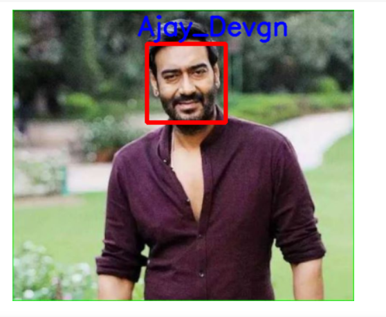

# Face-Recognition-Using-Deep-Learning-and-Opencv
Dataset Link - https://drive.google.com/drive/folders/1W6dXHt-y2GLqzmhRzMnA9XtyPNg69Gxv

The Dataset is Taken From Kaggle - https://www.kaggle.com/havingfun/100-bollywood-celebrity-faces

The Approch to the problem is that First you need to download the Dataset from Kaggle and place that Dataset on your local host and apply the pypi library made by my own to split the data into training testing and validation folders using https://pypi.org/project/Test-train-validation-split/

Then you need to upload that data on the google drive which you are working and name the folder as DatasetAI and in that folder their will be your Test Data and Train Data. 
Now Do do the Cleaning Part i have used HaarCascade Clasifier 

```python
face_classifier = cv2.CascadeClassifier(cv2.data.haarcascades +"haarcascade_frontalface_default.xml")
```

Then We segregated faces of the actors using opencv and haarcascades and created two folders namely Train_Images and Test_Images containing segeregated faces.

Then We trained  VGG16 Model on our  dataset  and got an validation accuracy of almost 91 percent and a training accuracy of 97 percent.
I tried different transfer learning models on this dataset but got higher accuracy with VGG16 

# How to run -
Clone this project onto your google colab and download the dataset of the link provided and you are good to go.



